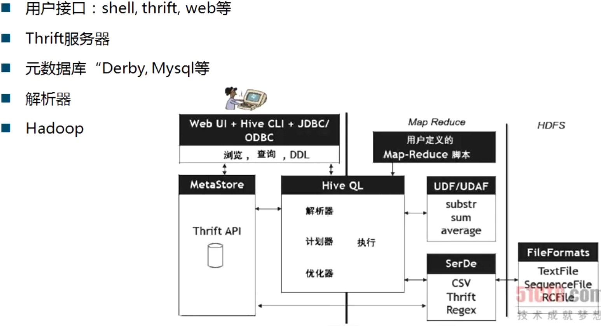

# Hive

## 一、了解 Hadoop 生态的中的 Hive

### 1、作用
在分布式存储大型数据集的查询和管理，使用类似于 sql 的语言称为 HiveQL，通过 HiveQL 执行 MapReduce 查询数据。

把 sql 转换成一个 MapReduce 的程序运行放到后台运行，再返回结果

### 2、历史
起源自 facebook 由 Jeff Hammerbacher 领导的团队

构建在 Hadoop 上的数据仓库框架

设计的目的是让 Java 技能较弱的分析师可以通过类 SQL 查询海量数据

2008 年 facebook 把 hive 项目贡献给 Apache


## 二、Hive 组件与体系架构

### 1、组件
```
用户接口 : shell Client、thrift(自动生成Java代码)、web UI

Thrift 服务器

元数据库 (MetaStore) "Derby,Mysql" 等

解析器 : 输入 SQL 映射为 MapReduce 的 job

Hadoop : Hive 的数据都是放在 Hadoop 里面的
```

### 2、构架图



### 3、端口
| 端口 | 说明 | 详细 |
| 0 0.0.0.0:10000 | hiveserver 服务端口 | Thrift Server 服务器 |


## 三、Hive 安装

### 1、三种安装模式
```
1) 内嵌模式
元数据保持在内嵌的 Derby 数据库中，一次只能有一个连接会话。

2) 本地独立模式
在本地安装 Mysql , 把元数据放到 Mysql 中

3) 远程模式
元数据放到远程的 Mysql 数据库中
```

### 2、我们采用 icloudera manager 部署


## 四、操作 Hive

### 1、shell 操作
部署完成以后，通过 shell 命令操作

```
1) 显示所有数据库
show databases;

2) 使用指定数据库
use x_database;

3) 显示所有表
show tables;

4) 删除表
drop table xxx;

5) 删除数据库
drop database xxx;

6) 创建表
看下面的详细说明

7) 重命名表 student to student2
alter table student rename to student2;

8) 增加列
alter table student add columns(sage int  comment 'the student's age');

9) 查看表结构
desc student;

10) 查看表的分区信息
show partitions student;

11) 截断表 (貌似无用)
RUNCATE TABLE student;

12) 复制表
CREATE TABLE empty_table_name LIKE table_name;
```


### 2、导入数据到 hive 中

#### 2.1、创建表
```
1) 普通表
create table student(sid int,sname string)
ROW FORMAT DELIMITED FIELDS TERMINATED BY '\t'
STORED AS TEXTFILE;

2) 创建索引表 (ds 为分区字段)
create table student_index(sid int , sname string) partitioned by (ds string)
ROW FORMAT DELIMITED FIELDS TERMINATED BY '\t'
STORED AS TEXTFILE;

3) 更详细索引表 (teacher、nickname 为分区字段,加上备注)
create table classmem_index_1(student string,age int)
partitioned by(teacher string comment 'the teacher',nickname string comment 'the nickname');
ROW FORMAT DELIMITED FIELDS TERMINATED BY '\t'
STORED AS TEXTFILE;  
```


#### 2.2、导入数据
```
1) 从本地文件导入数据

创建表，通过 \t (tab 键分割)
hive> create table wyp (id  int , name string,age  int , tel string) ROW FORMAT DELIMITED FIELDS TERMINATED BY '\t' STORED AS TEXTFILE;

*** 执行本地导入
hive> load data local inpath '/root/student_two.txt' overwrite into table student;

查看 dfs 文件接口
hive> dfs -ls /user/hive/warehouse/jason_test.db/wyp;


2) HDFS上导入数据到Hive表

*** hdfs 导入
hive> load data inpath '/home/wyp/add.txt' overwrite into table wyp;


3) 从别的表中查询出相应的数据并导入到Hive表中

*** 如果需要分区插入设置线下
hive> set hive.exec.dynamic.partition.mode=nonstrict;

*** 其他表导入数据(其中 age 是动态的分区)
hive> insert into table test
partition (age)
select id, name,tel, age from wyp;

```

#### 2.3、更复杂的数据导入
```
create external table nginx_accesslog(
    request_time string,
    upstream_response_time string,
    upstream_addr string,
    access_time string,
    hostname string,
    request_uri string,
    http_code string,
    bytes_sent string,
    referer string,
    user_agent string,
    remote_addr string,
    guid string)
row format SERDE 'org.apache.hadoop.hive.contrib.serde2.RegexSerDe'
WITH SERDEPROPERTIES ("input.regex" = "([^ ]+)\\s.*?\\s([^ ]+)\\s.*?\\s([^ ]+)\\s.*?\\s.*?\\s\\[([^ ]+)\\s\\+\\d{4}\\]\\s([^ ]+)\\s\"\\w+\\s([^ ]+)\\s.+?\"\\s(\\d+)\\s(\\d+)\\s\"([^ ]+)\"\\s\"(.*?)\"\\s\".*?\"\\s\"([^ ]+)\"\\s\"([\\w-]+)\"\\s.*","output.format.string" = "%1$s %2$s %3$s %4$s %5$s %6$s %7$s %8$s %9$s %10$s %11$s %12$s")
STORED AS TEXTFILE
location '/user/ray/nginxlog';
```

### 3、表说明

#### 3.1、表类型：
```
1) 普通表
一个表，就对应一个表名对应的文件。

2) 外部表 EXTERNAL
创建表，有指定EXTERNAL就是外部表，没有指定就是内部表，内部表在drop的时候会从HDFS上删除数据，而外部表不会删除。

EXTERNAL 关键字可以让用户创建一个外部表，在建表的同时指定一个指向实际数据的路径（LOCATION），Hive 创建内部表时，会将数据移动到数据仓库指向的路径；若创建外部表，仅记录数据所在的路径，不对数据的位置做任何改变。在删除表的时候，内部表的元数据和数据会被一起删除，而外部表只删除元数据，不删除数据。具体sql如下：
Sql代码
CREATE EXTERNAL TABLE test_1(id INT, name STRING, city STRING) SORTED BY TEXTFILE ROW FORMAT DELIMITED FIELDS TERMINATED BY'\t’ LOCATION ‘hdfs://http://www.cnblogs.com/..’

3) 分区表
有分区的表可以在创建的时候使用 PARTITIONED BY 语句。一个表可以拥有一个或者多个分区，每一个分区单独存在一个目录下。而且，表和分区都可以对某个列进行 CLUSTERED BY 操作，将若干个列放入一个桶（bucket）中。也可以利用SORT BY 对数据进行排序。这样可以为特定应用提高性能。具体SQL如下：

CREATE TABLE test_1(id INT, name STRING, city STRING)
PARTITIONED BY (pt STRING)
ROW FORMAT DELIMITED FIELDS TERMINATED BY‘\t’
SORTED BY TEXTFILE

分区表实际是一个文件夹，表名即文件夹名。每个分区，实际是表名这个文件夹下面的不同文件。分区可以根据时间、地点等等进行划分。比如，每天一个分区，等于每天存每天的数据；或者每个城市，存放每个城市的数据。每次查询数据的时候，只要写下类似 where pt=2010_08_23这样的条件即可查询指定时间得数据
```

#### 3.2、注意事项
```
Hive不支持一条一条的用insert语句进行插入操作，也不支持update的操作。数据是以load的方式，加载到建立好的表中。数据一旦导入，则不可修改。要么drop掉整个表，要么建立新的表，导入新的数据。

数据类型
TINYINT
SMALLINT  
INT  
BIGINT  
BOOLEAN
FLOAT  
DOUBLE  
STRING

如果数据需要压缩，使用 [STORED AS SEQUENCE] 。
默认采用 [STORED AS TEXTFILE]。
```

#### 3.3、insert+select
```
    这个是完全不同于文件操作的数据导入方式。官方指导为：
Sql代码
Standard syntax:
INSERT OVERWRITE TABLE tablename1 [PARTITION (partcol1=val1, partcol2=val2 ...)] select_statement1 FROM from_statement

Hive extension (multiple inserts):
FROM from_statement
INSERT OVERWRITE TABLE tablename1 [PARTITION (partcol1=val1, partcol2=val2 ...)] select_statement1
[INSERT OVERWRITE TABLE tablename2 [PARTITION ...] select_statement2] ...

Hive extension (dynamic partition inserts):
INSERT OVERWRITE TABLE tablename PARTITION (partcol1[=val1], partcol2[=val2] ...) select_statement FROM from_statement  
```


## 四、Java 连接 hive
10000
